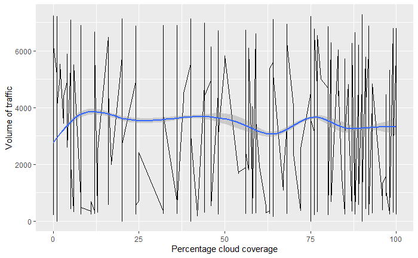
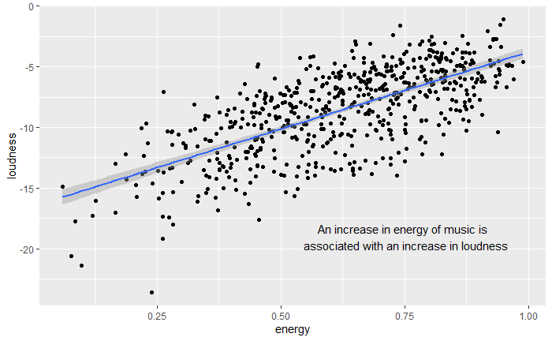
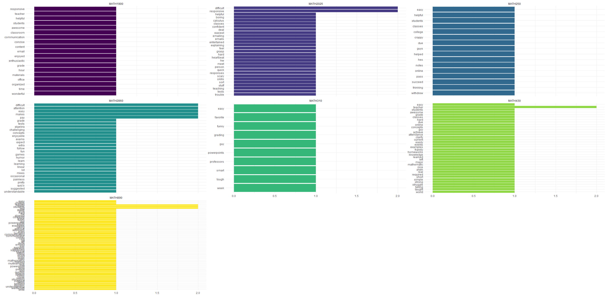

# Data Visualization and Reproducible Research

> Scott Shriver 

Learn more about me in my [GitHub profile page](https://github.com/sshriver)

The following is a sample of products created during the _"Data Visualization and Reproducible Research"_ course.

## Project 01

In the `project_01/` folder you can find an analysis of how factors such as weather and snow volume impact the amount of traffic on I-94 in Minnesota.

## Project 02

In this project, I explored the relationship between danceability and loudness to the energy of songs. Find the code and report in the `project_02/` folder.

(you can also place your figures in the `figures/` folder and use the `` option to add the pictures here)

## Project 03

In this project, I explored the frequency of various words used by students in professor reviews

### Moving Forward

Over this class I have learned a lot on how to tell stories from data analysis by focusing on making data that a target audience can purposefully use. I plan on using much of this for my thesis as I work on presenting the effectiveness of GANs systems. While that work is mainly being done in Python, the actual concepts of this course will be extremely valuable.
