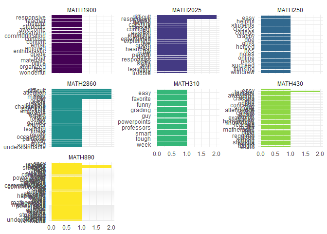

# Data Visualization Project 03


## Visualizing Text Data

Review the set of slides (and additional resources linked in it) for visualizing text data: https://www.reisanar.com/slides/text-viz#1

Choose any dataset with text data, and create at least one visualization with it. For example, you can create a frequency count of most used bigrams, a sentiment analysis of the text data, a network visualization of terms commonly used together, and/or a visualization of a topic modeling approach to the problem of identifying words/documents associated to different topics in the text data you decide to use. 

Make sure to include a copy of the dataset in the `data/` folder, and reference your sources if different from the ones listed below:

- [Billboard Top 100 Lyrics](https://github.com/reisanar/datasets/blob/master/BB_top100_2015.csv)

- [RateMyProfessors comments](https://github.com/reisanar/datasets/blob/master/rmp_wit_comments.csv)

- [FL Poly News 2020](https://github.com/reisanar/datasets/blob/master/poly_news_FL20.csv)

- [FL Poly News 2019](https://github.com/reisanar/datasets/blob/master/poly_news_FL19.csv)

(to get the "raw" data from any of the links listed above, simply click on the `raw` button of the GitHub page and copy the URL to be able to read it in your computer using the `read_csv()` function)

#### I will be working on a visualization of frequent word usage in RateMyProfessor comments

Saving the csv to a dataframe


```r
library(tidyverse)
```

```
## -- Attaching packages --------------------------------------- tidyverse 1.3.1 --
```

```
## v ggplot2 3.3.5     v purrr   0.3.4
## v tibble  3.1.4     v dplyr   1.0.7
## v tidyr   1.1.3     v stringr 1.4.0
## v readr   2.0.1     v forcats 0.5.1
```

```
## -- Conflicts ------------------------------------------ tidyverse_conflicts() --
## x dplyr::filter() masks stats::filter()
## x dplyr::lag()    masks stats::lag()
```

```r
library(tidytext)
```

```
## Warning: package 'tidytext' was built under R version 4.1.2
```

```r
ratings <- read.csv("https://raw.githubusercontent.com/reisanar/datasets/master/rmp_wit_comments.csv")
ratings
```

```
##      course
## 1  MATH1900
## 2   MATH250
## 3  MATH2860
## 4  MATH2860
## 5  MATH2025
## 6  MATH2025
## 7  MATH2860
## 8  MATH2025
## 9   MATH430
## 10  MATH430
## 11  MATH430
## 12  MATH890
## 13  MATH890
## 14  MATH310
## 15  MATH890
## 16  MATH890
## 17  MATH250
## 18  MATH250
##                                                                                                                                                                                                                                                                                                                                                          comments
## 1         He is very enthusiastic to help students. His course content is organized and the lecture is clear and  concise. I really enjoyed his lecture. He is very on-time to grade course materials and responsive on email-communication. He is not only helpful in the classroom but also in his office hour.  Overall he is a wonderful and awesome teacher.
## 2                                                                                                                                                                                                                                                                                   Great professor, really wants his students to pass. Puts all his notes online
## 3                                                                                                                                                                                               Lectures are clear and pretty easy to follow. He is always open to extra help all you need to do is ask. Great Professor, challenging course. You'll learn a lot.
## 4    He is a great professor. He mixes humor into all of his lectures, and he makes class interesting so it was easy to pay attention in them. Though some concepts are difficult to understand in linear algebra, he tries to make it as painless as possible. His exams aren't very difficult if you pay attention in class. I would definitely take him again.
## 5                                                                                                                                                    i found him to be a good professor he keeps the class entertained and his classes are never boring. I found it hard to meet with him in person but he is very responsive through emails and responses quick.
## 6                                                                                           He is a great professor. I would take him again in a heartbeat. His lectures are really good. Like any other professor, you have tests, but he's really good at explaining things so they're not difficult even though the material isn't the easiest stuff to grasp.
## 7                                                                                                                                              Great professor, occasional fun games to help learning, lectures are thorough and understandable, few quiz's and tests but if you do "suggested problems" you can expect a good grade. Makes class very enjoyable.
## 8         He is a great professor. Calculus has always been sort of scary to me, and while the material in his class is very difficult, he is so good at teaching it that it really becomes not a big deal. I feel way more confident in my calc skills now! Also, he's great at emailing you back if you ever have trouble with HW. Very responsive and helpful.
## 9                He is an awesome professor! I'm not one for math at all and frankly struggle with it but with his lectures i was able to understand most of the concepts he taught us and when i didn't understand something, he was able to further clarify very easily. He has a very strong knowledge of the material which is a must taking any math course.
## 10                                                                                     Best math teacher you will ever have. He is the man, plain and simple. Easy, short online homeworks that help you understand the material. he never took attendance, but with any math classes you better show up or else you get left behind. Great class, great teacher.
## 11                                                                     Great Professor,  He is a really nice guy. Wants students to achieve and take what they learned into the real world. The course was required due to my major but i would take him again for any other class. He doesn't grade too hard and will use current events in mathematic examples.
## 12                                                            Great guy. I loved the class. He has a great way of communicating the material to you so I suggest you show up to class since he does give pop-quizzes that end up hitting your grade hard at the end. It's the main reason I got bumped down to a B+.   Heads up though, he loves to make "jokes."
## 13 He is a talented teacher.  Can convey material well and often touches back on other points to really embed them in your brain.  Easy to approach and will work something out with you if you missed a HW or a Quiz or both.  Powerpoints are great but he does write out examples too.  He sends out a pretest before each test which rocks.  Great Professor.
## 14                                                                                     One of my favorite professors, very smart and funny guy! The lectures are given with powerpoints, always clear and interesting. We had homework once a week, never too tough. I would say his grading is on the easy side. I would definitely take another class with him.
## 15  Easily the best mathematics professor I had at Wentworth. I was really anxious about taking Linear Algebra as in Diff Eqs and Multivariable Calc I was really struggling understanding what was happening during lectures.    Really cool dude and a great communicator. Powerpoint lectures he makes are very clear cut and extremely helpful for test prep.
## 16                                                                                                                                                        Great class. Relates well to students. Funny. Explains concepts well and takes time for everyone to understand. Homework not often but you must do it. Very helpful and looks out for all his students.
## 17                                                                                                                                                                                                                                                                                                                                 Great classes, great semester!
## 18                                                                  Had him for pre-calc. I know you guys are thinking pre Calc must be easy but I'm not really good at math. I withdrew from pre calc Last semester due to a crappy professor and Professor He helped me understand it so much. Hes helpful and just want you to succeed and do well in college.
```

Need to get comments into one-term-per-row format, also would like to remove stop words as well as various terms within that may not be very meaningful


```r
# creating dataframe of extra words to remove
remove_words <- data.frame(word = c("professor", "class", "student", "material", "lectures", "homework", "math", "calc", "pre", "lecture", "semester", "found", "understand"))

ratings_words <- ratings %>%
  # unnesting comments into words
  unnest_tokens(output = word, input = comments) %>%
  
  # removing stop words and previously listed words
  anti_join(stop_words, by = "word") %>%
  anti_join(remove_words, by = "word") %>%
  
  # making the wordcounts
  group_by(course) %>%
  count(word, sort = TRUE) %>%
  top_n(9, n) %>%
  ungroup() %>%
  mutate(word = fct_inorder(word))

head(ratings_words)
```

```
## # A tibble: 6 x 3
##   course   word           n
##   <chr>    <fct>      <int>
## 1 MATH2025 difficult      2
## 2 MATH2025 responsive     2
## 3 MATH2860 attention      2
## 4 MATH2860 difficult      2
## 5 MATH2860 easy           2
## 6 MATH2860 makes          2
```

Making a grid of bar charts showing word frequency per course


```r
ggplot(ratings_words, aes(x = n, y = fct_rev(word), fill = course)) +
  geom_col() +
  guides(fill = FALSE) +
  labs(x = NULL, y = NULL) +
  scale_fill_viridis_d() +
  facet_wrap(vars(course), scales = "free_y") +
  theme_minimal()
```

```
## Warning: `guides(<scale> = FALSE)` is deprecated. Please use `guides(<scale> =
## "none")` instead.
```

<!-- -->

